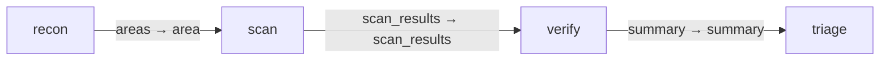

# review_graph

A frozen fixture copy of the `code_review` graph pack (gents-ai/packs,
`packs/gents/code_review`, at the sha recorded when this fixture was
captured), for graph-pack machinery tests: install, revision checks, the
loader, and the graph-pipeline contract tests. It is test data, not a
shipped pack, and drifts from the official pack by design.

Internal ids are unchanged from the source pack (graph id `code-review`,
capability/task/behavior ids `review-*`, and every schema), so tests written
against the real pack's shape keep working against this fixture. Prompts are
trimmed to a few lines; no plan is shipped, so install always compiles fresh.

<!-- pack-topology:start -->

<!-- pack-topology:end -->
